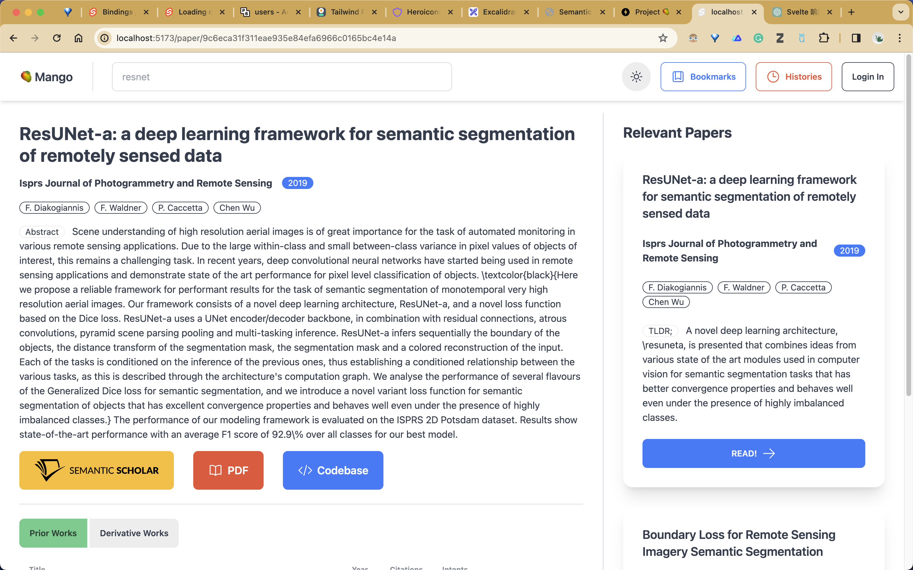
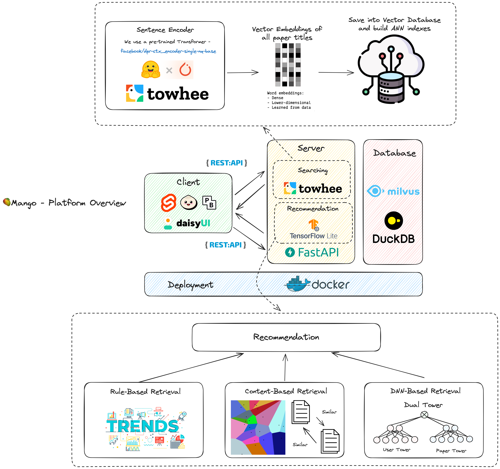
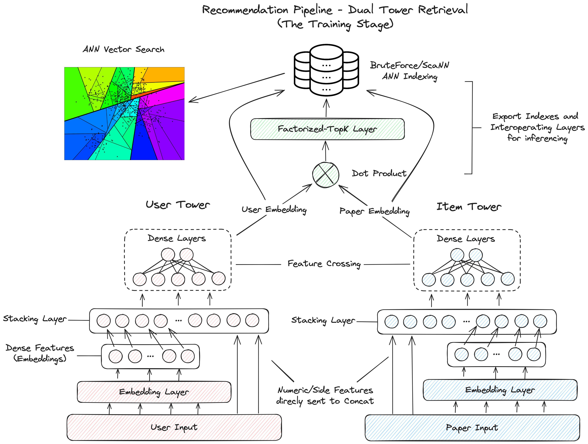
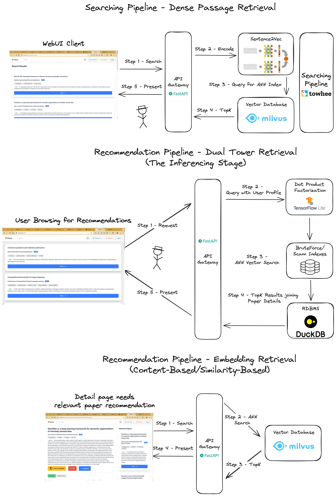

### IRS-PM-2023-10-29-IS24FT-GRP24-Mango-AcademicKnowledgePlatform

---

## SECTION 1 : PROJECT TITLE
## Mango - An Academic Knowledge Platform

---

## SECTION 2 : EXECUTIVE SUMMARY
Mango is an academic knowledge platform for college students and researchers.

It has two main components -

* A **Search Engine** for essays with their summaries.
* An **Academic Papers Recommender** for the latest and valuable academic papers.

The platform aims to assist young college students and researchers to quickly grab a general understanding of a particular field.

* It can also help them to keep up to date on the forefront development and progress of that field.

---

## SECTION 3 : CREDITS / PROJECT CONTRIBUTION

| Official Full Name  | Student ID  | Work Items | Email |
| :------------ |:---------------:| :-----| :-----|
| Li Jiacheng | A0285823W | Data Preprocessing,  Whole System designing and implementation  Search and Recommendation system designing | jiacheng.li@u.nus.edu |
| Goh Min Hua | A0285810A | Data Preprocessing,  Recommendation algorithm and system designing and development | e1221622@u.nus.edu |
| Mao Zhihong | A0285799X | Data Preprocessing,  Search algorithm and engine designing and development | zhihong.mao@u.nus.edu |

---

## SECTION 4 : VIDEO OF SYSTEM MODELLING & USE CASE DEMO

* Promotion: https://youtu.be/VvDoVLDkDYM
* System: https://youtu.be/ODpb9tNP02g

---

## SECTION 5 : USER GUIDE

> Please refer to the document **"Mango - User Guide"** within the ***Project Report*** folder.

---
## SECTION 6 : PROJECT REPORT

`Refer to Github Folder: ProjectReport`

1.	EXECUTIVE SUMMARY	3
2.	INTRODUCTION	4
2.1.	Business Problem Background	4
2.2.	Current Solutions	4
2.3.	Market Research	5
2.4.	Project Objectives	8
2.5.	Success Measurements	8
3.	PROJECT SOLUTION (SYSTEM DESIGN AND MODEL)	9
3.1	Architecture Overview	9
Detailed Workflow	9
Technical Stack and Architecture	9
3.2	Data Management	10
Data Sources	10
Data Preparation	10
Pre-processed Training Dataset	11
Vector Database for ANN indexes	11
4.	PROJECT IMPLEMENTATION	12
4.1	Information Retrieval System – Dense Passage Retrieval	12
4.2. Recommendation System (Trending Page)	13
Dual Tower Model	13
Training Process	14
4.3. Recommendation System (Relevant Papers)	15
5.	PROJECT PERFORMANCE AND VALIDATION	15
6.	CONCLUSION	19
6.1	Challenges and Solutions	19
6.2	Future Considerations	19
APPENDIX A – PROJECT PROPOSAL	20
APPENDIX B – MAPPED SYSTEMS FUNCTIONALITIES AGAINST KNOWLEDGE, TECHNIQUES AND SKILLS OF MODULE COURSES	30
APPENDIX C – INSTALLATION AND USER GUIDE	31
APPENDIX D – INDIVIDUAL PROJECT REPORT	35
Li Jiacheng (A0285823W)	35
Mao Zhihong (A0285799X)	36
Goh Min Hua (A0285810A)	37
REFERENCES	38

---
## SECTION 7 : MISCELLANEOUS

`Refer to Github Folder: Miscellaneous`

### Mango - Survey

The survey for the mango project.
